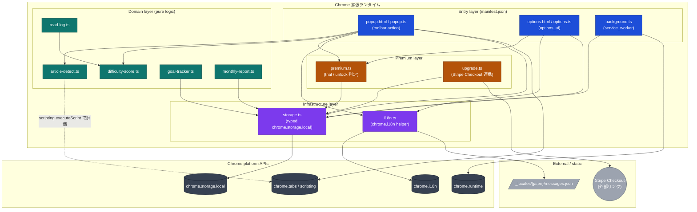
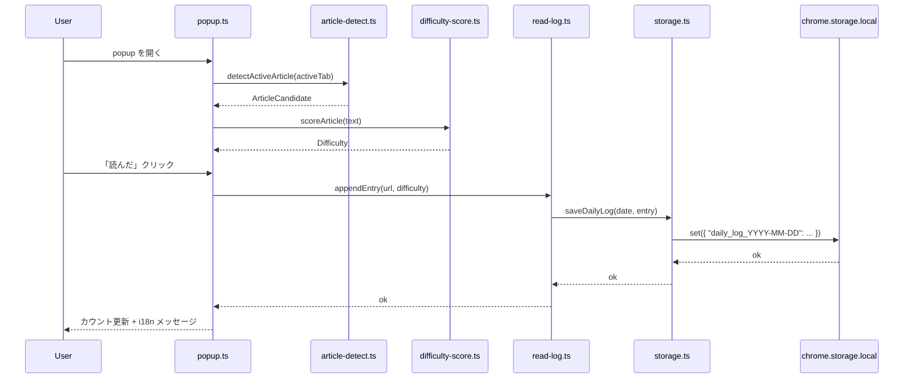

# Architecture — reading-tracker

Chrome Manifest V3 拡張機能のコンポーネント構成を可視化したドキュメント。
ファイル単位ではなく「役割の層」で捉えるためのリファレンス。

## レイヤー構成

- **Entry layer** — `manifest.json` が宣言する UI / service worker のエントリポイント
  (popup, options, background)。
- **Domain layer** — 副作用を持たない純粋ロジック (記事検出、難易度算定、読書記録、
  目標トラッカー、月次レポート)。テスト容易性のためここに集約する。
- **Infrastructure layer** — Chrome 拡張 API への薄いラッパ
  (`storage.ts` = chrome.storage.local, `i18n.ts` = chrome.i18n)。
- **Premium layer** — 7 日トライアル / Stripe Checkout 解放判定
  (`premium.ts`, `upgrade.ts`)。

## コンポーネント図

## データフロー (代表例: 「読んだ」ボタン押下)

## 設計上の不変条件

- **個人情報は外部送信しない**: ネットワーク I/O は `Upgrade → Stripe Checkout` の
  外部リンク遷移のみ。Domain / Infrastructure 層からの fetch は禁止。
- **service worker は短時間**: `background.ts` は install / update イベント中心、
  長時間 keep-alive 禁止 (MV3 要件)。
- **schemaVersion で前方互換**: `Settings.schemaVersion` を経由して旧バージョンの
  設定を吸収。`storage.ts` の loader が defaults とマージして返す。
- **i18n は全文字列を経由**: UI 文字列は必ず `chrome.i18n` 経由
  (`_locales/{ja,en}/messages.json`)。manifest の `name` / `description` も
  `__MSG_appName__` / `__MSG_appDesc__` で参照。
- **Premium 判定は単一経路**: trial 期限 / unlock 状態の判定は `premium.ts` のみ。
  popup / options から直接 `chrome.storage` を覗かない。
